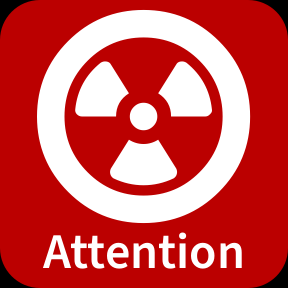

SDKIG
=====

**Stream-Deck Key-Image Generator**

<p/>


<p/>


Abstract
--------

SDKIG is a small utility for generating key images for Elgato Stream
Deck devices. The key images have to be of size 288x288 pixels (although
the device seems to downscale them to 72x72 pixels) and are generated
by the combination of a FontAwesome icon and a TypoPRO Source Sans Pro
title. The colors of the background, the icon and the title can be
choosen through RGB values.

Installation
------------

```sh
$ npm install -g sdkig
```

Usage
-----

```sh
$ sdkig \
    -b bb0000 \
    -i radiation-alt -I ffffff \
    -t "Attention"   -T ffc0c0 \
    -o sample.png
```



License
-------

Copyright &copy; 2020 Dr. Ralf S. Engelschall (http://engelschall.com/)

Permission is hereby granted, free of charge, to any person obtaining
a copy of this software and associated documentation files (the
"Software"), to deal in the Software without restriction, including
without limitation the rights to use, copy, modify, merge, publish,
distribute, sublicense, and/or sell copies of the Software, and to
permit persons to whom the Software is furnished to do so, subject to
the following conditions:

The above copyright notice and this permission notice shall be included
in all copies or substantial portions of the Software.

THE SOFTWARE IS PROVIDED "AS IS", WITHOUT WARRANTY OF ANY KIND,
EXPRESS OR IMPLIED, INCLUDING BUT NOT LIMITED TO THE WARRANTIES OF
MERCHANTABILITY, FITNESS FOR A PARTICULAR PURPOSE AND NONINFRINGEMENT.
IN NO EVENT SHALL THE AUTHORS OR COPYRIGHT HOLDERS BE LIABLE FOR ANY
CLAIM, DAMAGES OR OTHER LIABILITY, WHETHER IN AN ACTION OF CONTRACT,
TORT OR OTHERWISE, ARISING FROM, OUT OF OR IN CONNECTION WITH THE
SOFTWARE OR THE USE OR OTHER DEALINGS IN THE SOFTWARE.

